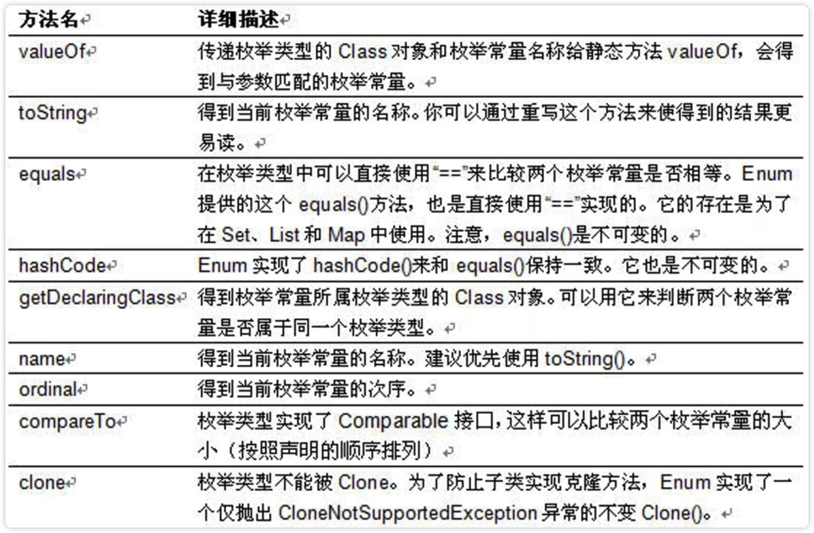

# 枚举类

枚举（enumeration）是一组常量的集合，是一种特殊的类，里面只包含一组**有限的、特定的**对象

枚举的实现方式：（1）自定义枚举；（2）使用`enum`关键字实现枚举

## 自定义枚举

1. 将构造器私有化，防止直接`new`

2. 去掉`setXxx`方法，防止属性被修改，可以提供`getXxx`方法

3. 在类的内部，直接创建固定的对象，例如：

   ```java
   public final static Season SPRING = new Season("春天", "温暖");
   public final static Season SUMMER = ...;
   ...; // 秋天，冬天
   ```

   使用`final static`共同修饰，`static`用于静态访问，`final`用于避免类的自动加载，变量名大写

## enum关键字

使用步骤：

1. 使用关键字 `enum` 替代`class`

2. ```java
   public final static Season SPRING = new Season("春天", "温暖");
   ->
   SPRING("春天", "温暖");
   ```

3. 如果有多个常量（对象），使用“，”间隔，例如：

   ```java
   SPRING("春天", "温暖"), SUMMER("夏天", "炎热"), AUTUMN("秋天", "凉爽"), WINTER("冬天", "寒冷");
   ```

4. 要求将常量对象（例如SPRING）写在最前面，属性、成员方法等要写在常量对象的后面

5. 如果使用无参构造器创建常量对象，则可以省略括号，例如

   ```java
   SPRING("春天", "温暖"), SUMMER("夏天", "炎热"), AUTUMN, WINTER;
   ```

**注意事项和细节**

1. 使用`enum`关键字后，就不能继承其他类了，因为`enum`会隐式继承`Enum`类，而Java是单继承机制
2. 枚举类和普通类一样，可以实现接口，语法为： enum 类名 implements 接口1，接口2 {}

## enum常用方法

使用关键字`enum`时，会隐式继承`Enum`类，包含以下几个方法：

`ordinal`: 输出枚举常量的序号，从0开始编号；

`values`: 隐藏方法，可以通过反编译看到，返回的是所有常量的数组；

`valueOf`: 将字符串转化为枚举对象，要求字符串必须为已有的常量名，否则报异常

`compareTo`: 比较两个枚举常量，比较的是编号，两个对象的编号相减


